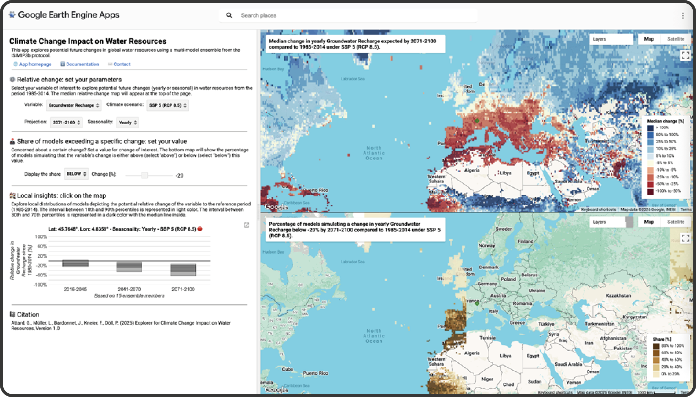

## "What's in this repository?"

Hello! This is a tutorial for the Climate Change Impact on Water Resources Explorer at [https://ee-gwp.projects.earthengine.app/view/cciwr-explorer](https://ee-gwp.projects.earthengine.app/view/cciwr-explorer).

-------

It is based on a minimalistic template repository for creating online courses in higher education created for the [DiLER](https://diler-digitell.github.io/examples.html) (Digital Literacy for Empirical Research) project, financed by [DigiTeLL](https://www.uni-frankfurt.de/106198465/Digital_Teaching_and_Learning_Lab___DigiTeLL) (Goethe-University Frankfurt). Credit goes to the original G0RELLA template lectures.

### "I have some questions..."

[Open an issue]() on this repository and someone will try and get back to you as soon as possible!
